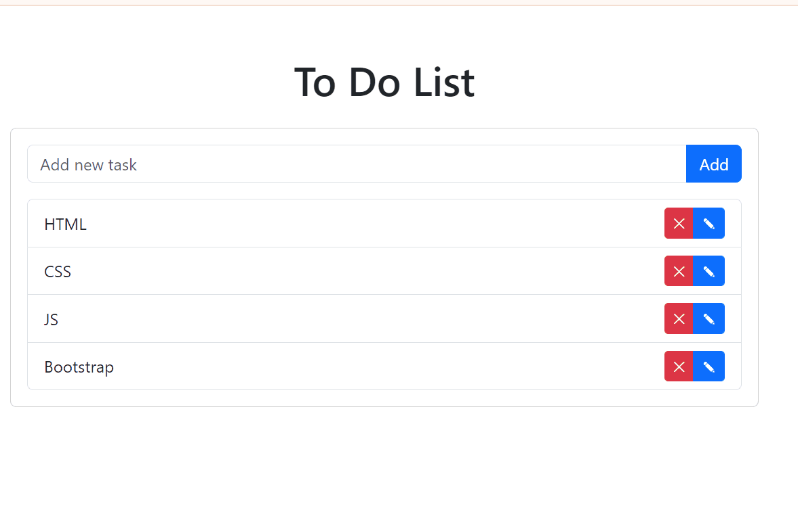

    

# ATIVIDADE 10 - Sistema de tarefas a fazer

Repositório criado para mostrar uma aplicação de atividades a fazer da disciplina de Linguagem de programação para Web I, do curso de Técnico de Informática para Internet do
Instituto Federal Sul Riograndense (IFSul), [Campus Santana do Livramento](http://www.santana.ifsul.edu.br/).

## Enunciado da atividade: 

Com os conhecimentos adquiridos em sala e as atividades já desenvolvidas, escreva um sistema para registro de atividades a fazer (em inglês, "to-do list"). Esta atividade pode ser feita em duplas.

## Requisitos do sistema:

#### Armazenamento dos Dados:

- Grave os dados em um arquivo de texto com extensão TXT, onde cada linha representa uma atividade a ser realizada.

#### Funcionalidades:

- O usuário deve ser capaz de inserir, editar e remover tarefas. Todas as operações devem ocorrer no mesmo arquivo, com nome index.php, que deve estar dentro de uma pasta criada para esta atividade (ex: lpw1-atv10).

#### Navegação e Identificação das Operações:

- Para identificar qual parte do código deve ser chamada, use o comando switch com um identificador GET para cada operação. Exemplo:
  - Para inserir um novo registro, abrir a URL: http://localhost/.../index.php?operacao=novo
  - Para editar um registro, abrir a URL: http://localhost/.../index.php?operacao=editar&id=1
  - Para excluir um registro, abrir a URL: http://localhost/.../index.php?operacao=excluir&id=1

#### Comentário no Código:

- Coloque seu nome (e o nome de sua dupla, se for o caso) em um comentário no início do arquivo PHP.

#### Estilo e Layout:

Utilize o Bootstrap como framework CSS para criar um layout semelhante a este:

    

